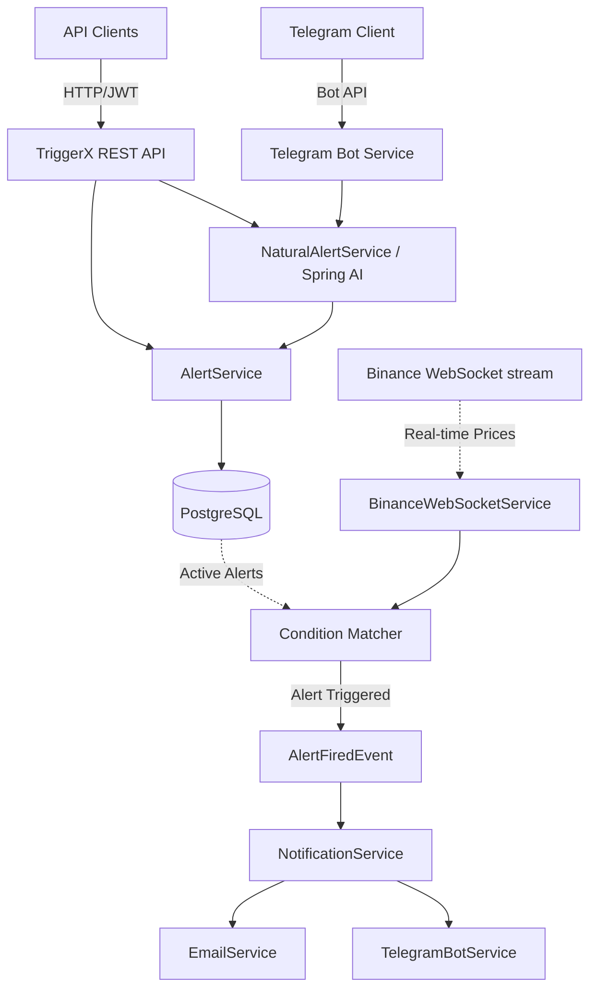

# ⚡️ TriggerX

<div align="center">
  <p><strong>A high-performance, real-time cryptocurrency price alert system built with Spring Boot 3 & Java 21.</strong></p>
  <p>🚀 <em>The application is accessible at <strong><a href="https://triggerx.in">triggerx.in</a></strong></em></p>
</div>

TriggerX enables users to set customizable price targets on Binance trading pairs. It delivers instant, zero-latency notifications via **Email** and **Telegram** when specified price thresholds are met.

By leveraging Binance's free real-time WebSocket stream, TriggerX securely supports numerous active alerts per user without incurring API costs.

## Repository Description

TriggerX is a backend service for monitoring cryptocurrency prices. It connects to Binance WebSocket streams and sends notifications via email and Telegram when user-defined price targets are reached. It is built with Spring Boot and uses PostgreSQL for storing data and managing active alerts.

---

## ✨ Features

- **Real-Time Market Data**: Direct Binance WebSocket integration streams miniTicker prices for highly efficient, free-of-cost price monitoring.
- **Natural Language Processing**: Groq API integration (`llama-3.3-70b-versatile` via Spring AI) allows the creation of alerts using conversational English (e.g., "Alert me when ETH drops below 2500").
- **Passwordless Authentication**: Secure OTP-over-email system generating JWT tokens for stateless, frictionless session management.
- **Telegram Bot Integration**: Full webhook-free bot integration via direct linking. Receive instant alerts or interact directly with the bot to create alerts via natural language commands.
- **High Concurrency**: Carefully engineered atomic database updates prevent race conditions and duplicate notification dispatches.

---

## 🛠 Technology Stack

| Category | Technologies |
|---|---|
| **Core** | Java 21, Spring Boot 3.3.x |
| **Database** | PostgreSQL, Flyway (Migrations), Spring Data JPA |
| **Security** | Custom JWT Filter, OTP Verification |
| **Integrations** | Gmail SMTP, Telegram Bot API, Spring AI + Groq (`llama-3.3-70b-versatile`) |
| **Realtime** | `Java-WebSocket` for Binance Streaming |

---

## 🏗 Architecture Overview



## 🚀 Getting Started

### Prerequisites
- **Java 21**
- **Maven**
- **Docker** and **Docker Compose** (for running PostgreSQL locally)

### Local Development Setup

```bash
# 1. Boot up the PostgreSQL instance using the pre-configured docker-compose file
docker-compose up -d

# 2. Start the application with the 'dev' profile
# Note: OTP codes will print to the console. Telegram bot is disabled by default. No Gmail configuration required.
mvn spring-boot:run -Dspring-boot.run.profiles=dev
```

The application will be accessible at `http://localhost:8080`.

### Natural Language Configuration

To enable the AI parsing for the `/api/v1/alerts/natural` endpoint, provide a free Groq API key:

1. Create a file named `application-local.properties` (gitignored by default) in `src/main/resources`.
2. Add your key:

```properties
spring.ai.openai.api-key=your_groq_key_here
```

Restart the server to apply the changes. Note: Without this key, the NLP endpoint returns an HTTP 503 response, while all other features continue to operate normally.

---

## 🧪 Testing via Postman & Telegram Bot

You can manually verify all functionalities natively through **Postman** (or your preferred API client) along with the **Telegram Bot**.

### Testing with Postman
1. **Send OTP:** Issue a `POST /api/v1/auth/otp/send` with your email address to receive an authorization code. This code will be printed directly to your console (in dev mode) or sent to your email (in active environments).
2. **Verify & Tokenize:** Request `POST /api/v1/auth/otp/verify` using the email and the provided OTP to obtain a JWT.
3. **Execute API Calls:** Inject the obtained JWT token into your Postman environment under the `Authorization` header (`Bearer <jwt>`) to authenticate requests to the protected `/api/v1/*` endpoints.

### Telegram Live Testing
Once logged in, link your account to `@TriggerX_AlertBot` directly via the URL generated from the `/api/v1/telegram/link-token` endpoint. Once linked:
- Watch live notifications arrive instantly across Telegram as your simulated alerts trigger.
- Message the bot directly (e.g., "Send me a notification when Bitcoin passes 100k") and observe the NLP engine securely provisioning the alert against your account.

---

## 📖 API Documentation

Complete overview of the available REST API endpoints:

### Authentication Endpoints
| Method | Endpoint | Auth Required | Description |
|---|---|---|---|
| `POST` | `/api/v1/auth/otp/send` | No | Send OTP confirmation code to the user's email |
| `POST` | `/api/v1/auth/otp/verify` | No | Verify OTP code and return an authentication JWT |

### Alert Management Endpoints
| Method | Endpoint | Auth Required | Description |
|---|---|---|---|
| `POST` | `/api/v1/alerts` | Yes | Create a newly structured alert based on specific metrics |
| `POST` | `/api/v1/alerts/natural` | Yes | Parse natural English text to generate a structured alert |
| `GET`  | `/api/v1/alerts` | Yes | Fetch all active and triggered alerts for the authenticated user |
| `GET`  | `/api/v1/alerts/{id}` | Yes | Fetch complete details for a specific alert |
| `DELETE` | `/api/v1/alerts/{id}` | Yes | Delete a specific alert by its ID |

### Symbols & System Endpoints
| Method | Endpoint | Auth Required | Description |
|---|---|---|---|
| `GET`  | `/api/v1/symbols/search?q=` | No | Returns search and autocomplete results for ticker symbols |
| `GET`  | `/api/v1/health` | No | System health check (useful for PaaS monitoring routing) |

### Integrations Endpoints
| Method | Endpoint | Auth Required | Description |
|---|---|---|---|
| `POST` | `/api/v1/telegram/link-token` | Yes | Dynamically generates a Telegram bot connecting deep-link |
| `POST` | `/api/v1/extension/auth-token` | Yes | Issue a temporary token to pass sessions to browser extensions |
| `POST` | `/api/v1/extension/redeem` | No | Redeem the ephemeral token to provision an extension JWT |

> **Authentication Header:** All protected endpoints require a valid JWT header provided as `Authorization: Bearer <token>`

---

## 🧩 Technical Implementation Details

1. **Precision & Integrity:** Cryptocurrency prices are tracked strictly using `DECIMAL(19,8)` within PostgreSQL. Traditional floating-point approximations are avoided to ensure precise market boundary triggering.
2. **Dynamic Streaming Optimization:** The `BinanceWebSocketService` manages network requests intelligently by opening websocket pipes uniformly for currency pairs registered with active user alerts - preventing extraneous data bloat.
3. **Concurrency Isolation:** The backend gracefully solves concurrency via atomic SQL matching clauses (`UPDATE ... WHERE status = 'ACTIVE'`). This mitigates potential race conditions when multithreaded systems intercept shared asset pricing updates.
4. **Browser Extension Ephemeral Login:** Secure session mirroring to browser extensions employs a 120-second sliding-window token exchange mechanism, allowing instant multi-platform continuity.

---

## 🚢 Deployment Configuration

TriggerX is architected and built for swift cloud deployments. To push straight to **Azure App Service (B1 Tier)** connected to an **Azure Database for PostgreSQL Flexible Server**, execute:

```bash
# Compile and build the artifact skipping local unit checks
mvn clean package -DskipTests

# Deploy up to azure resource groups seamlessly
az webapp up --name triggerx-backend --resource-group triggerx-rg --sku B1
```

### Environment Variables Matrix
Application properties mandate these parameters supplied externally in advanced environments:

- `DB_URL`, `DB_USERNAME`, `DB_PASSWORD` : PostgreSQL connection details
- `JWT_SECRET` : Secure, pseudo-random signing secret (32+ chars length)
- `MAIL_USERNAME`, `MAIL_PASSWORD` : Associated SMTP or App Specific Password
- `TELEGRAM_BOT_TOKEN`, `TELEGRAM_BOT_USERNAME` : Assigned from Telegram BotFather platform

*Note: Container orchestration routes health verifications via the pre-configured `/api/v1/health` and `/actuator/health` endpoint mappings bound inherently.*
